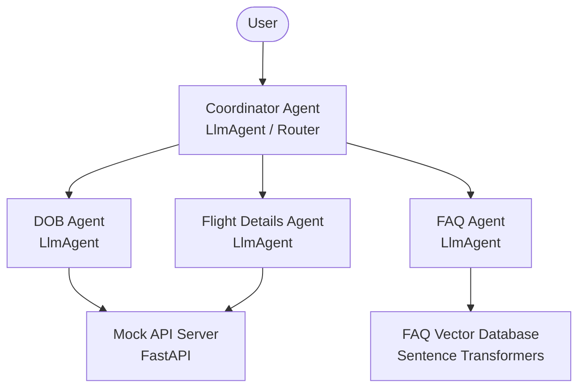

# Implementation Plan - Airline Customer Service Assistant

We are building an intelligent multi-agent Airline Customer Service Assistant using the Google Agent Development Kit (ADK). The system handles passenger booking management through specialized agents and a knowledge-based FAQ system.

## Proposed System Architecture

The multi-agent system consists of a parent coordinator agent and three specialized sub-agents:

- **Coordinator Agent (Router)**: The entry point that receives user queries, detects passenger intent, and dynamically delegates (transfers control) to one of the specialized sub-agents.
- **DOB Agent**: Handles updating passenger Date of Birth after verifying PNR existence, passenger validity, and DOB format.
- **Flight Details Agent**: Modifies flight details (departure/destination, flight number, date, time) after searching and confirming available flight matches.
- **FAQ Agent (RAG)**: Answers general customer queries regarding baggage, check-in, and refunds by embedding queries and matching them against a mock vector database containing airline policies.

---

## Proposed Changes

We will create a structured Python application in the workspace.

### [NEW] [mock_api.py](file:///c:/Users/vijeth/OneDrive/Documents/2.8%20year/3%20yr%20experiecne/Gen%20Ai/Airline%20Customer%20Service%20Assistant/mock_api.py)
A FastAPI backend simulating the airline's passenger booking database. It implements four endpoints:
- `GET /api/passenger/{pnr}`: Retrieves passenger and flight details. Returns 404 if PNR is invalid.
- `PUT /api/passenger/{pnr}/dob`: Updates a passenger's date of birth in memory. Validates PNR and passenger existence.
- `PUT /api/flight/{pnr}/details`: Updates flight itinerary details (flight number, cities, times) in memory.
- `GET /api/flight/search`: Searches and returns available flights matching departure, destination, and date queries.

### [NEW] [rag_service.py](file:///c:/Users/vijeth/OneDrive/Documents/2.8%20year/3%20yr%20experiecne/Gen%20Ai/Airline%20Customer%20Service%20Assistant/rag_service.py)
A local RAG service using the `sentence-transformers` library:
- Implements `FAQVectorDB` to embed sample airline policy documents.
- Exposes a `search(query: str, k: int = 1)` method that uses cosine similarity to retrieve the most relevant knowledge base chunks.
- Core knowledge areas: Baggage allowance (20kg economy limit, up to 30kg fee), check-in counters (3 hours before departure, close 45 minutes before), and refund policies (must submit 24 hours before flight departure).

### [NEW] [agents.py](file:///c:/Users/vijeth/OneDrive/Documents/2.8%20year/3%20yr%20experiecne/Gen%20Ai/Airline%20Customer%20Service%20Assistant/agents.py)
Defines the ADK agents and their corresponding tools:
- **DOB Agent**: Equipped with tools to update DOB, fetch booking details, and validate PNR context.
- **Flight Details Agent**: Equipped with tools to search flight availability, modify booking details, and validate itinerary routes.
- **FAQ Agent**: Equipped with the FAQ search tool to answer policy questions.
- **Coordinator Agent**: Serves as the router, delegating queries to the sub-agents and maintaining session state.
- **Context Management**: Preserves PNR and passenger identity in the runner session state `tool_context.state` so that user info is retained across agent transfers.

### [NEW] [main.py](file:///c:/Users/vijeth/OneDrive/Documents/2.8%20year/3%20yr%20experiecne/Gen%20Ai/Airline%20Customer%20Service%20Assistant/main.py)
The main execution script:
- Loads environment variables (specifically `GEMINI_API_KEY`).
- Spawns the FastAPI mock backend in a background process.
- Boots up the ADK multi-agent runner utilizing `InMemorySessionService`.
- Starts an interactive terminal chat loop representing a chat session.

---

## Verification Plan

We will verify our implementation using automated scripts and manual testing against the specified case study scenarios.

### Automated Tests
We will build a verification script `test_scenarios.py` to automate execution of the three test scenarios:
- **Scenario 1 (DOB Update)**:
  - Input: "I need to update my date of birth for booking ABC123"
  - Follow up: "15th January 1990"
  - Follow up: "Yes" (confirming change)
  - Verify that `GET /api/passenger/ABC123` returns DOB `1990-01-15`.
- **Scenario 2 (Flight Details Update)**:
  - Input: "I need to change my flight from KUL to BKK"
  - Follow up: "ABC123" (when prompted for booking)
  - Follow up: "Yes" (confirming flight change to AK456 at 14:30)
  - Verify that `GET /api/passenger/ABC123` returns the updated flight details (flight AK456 to BKK).
- **Scenario 3 (FAQ Query)**:
  - Input: "What is the baggage allowance for economy class?"
  - Verify that the answer retrieves the correct policy (20kg limit, extra charge up to 30kg) and presents it to the user.

### Manual Verification
- We can run `main.py` and interact with the chatbot in the terminal to verify user experience, error handling (e.g. invalid PNR, bad DOB format), and seamless agent routing.
